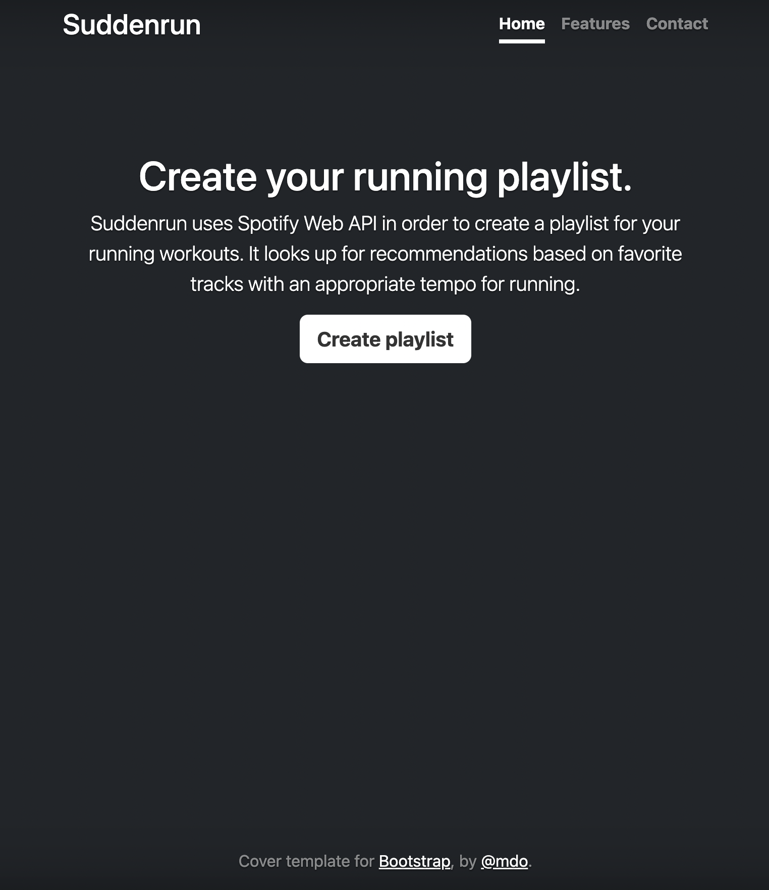

<a name="readme-top"></a>

[![MIT License][license-shield]][license-url]
[![LinkedIn][linkedin-shield]][linkedin-url]


<!-- PROJECT NAME -->

<br />
<div style="text-align: center;">
<h1>Suddenrun</h1>
</div>


<!-- TABLE OF CONTENTS -->

<details>
  <summary>Table of Contents</summary>
  <ol>
    <li>
      <a href="#about-the-project">About The Project</a>
      <ul>
        <li><a href="#built-with">Built With</a></li>
      </ul>
    </li>
    <li>
      <a href="#getting-started">Getting Started</a>
      <ul>
        <li><a href="#prerequisites">Prerequisites</a></li>
        <li><a href="#local-installation">Local installation</a></li>
        <li><a href="#cloud-deployment">Cloud deployment</a></li>
      </ul>
    </li>
    <li><a href="#usage">Usage</a></li>
    <li><a href="#roadmap">Roadmap</a></li>
    <li><a href="#license">License</a></li>
    <li><a href="#contact">Contact</a></li>
    <li><a href="#acknowledgments">Acknowledgments</a></li>
  </ol>
</details>


<!-- ABOUT THE PROJECT -->

# About The Project

Suddenrun uses Spotify Web API in order to create a playlist for your running workouts. It looks up for recommendations
based on favorite tracks with an appropriate tempo for running.

<!-- USAGE EXAMPLES -->

# Usage

IMPORTANT! Current version is in the development stage, so in order to use Suddenrun it can be deployed locally or in
the cloud. Suddenrun creates a playlist "Running workout" in your Spotify account.
Specific tracks could be added or removed and this information would be preserved and used during the update or creation
of a new playlist.

[](https://www.youtube.com/watch?v=SHc67ap1Zy8-Y "Suddenrun demo")

# Built With

Major frameworks and tools used to bootstrap Suddenrun project.

* [![Spring-boot][Spring.io]][Spring-url]
* [![Postgresql][Postgresql.org]][Postgresql-url]
* [![Javascript][Javascript.com]][Javascript-url]
* [![Kubernetes][Kubernetes.io]][Kubernetes-url]
* [![AWS][AWS.com]][AWS-url]
* [![Shellscript][Shellscript.sh]][Shellscript-url]

<!-- GETTING STARTED -->

# Getting Started

## Prerequisites

To install and deploy Suddenrun you will need:

* Spotify account
* Java 17
* Maven
* Kubectl
* Minikube (local deployment)
* eksctl (cloud deployment)
* AWS account (cloud deployment)

## Local installation

Current section covers installation on the local machine: copying repo, updating configuration, building image
and deploying application to minikube.

### Postgresql deployment

1. From project directory apply kubernetes resources
   ```shell
   kubectl apply -f k8s/minikube/bootstrap/postgres
   ```
   ```shell
   configmap/postgres-config created
   service/postgres created
   statefulset.apps/postgres created
   persistentvolume/postgres-pc-volume created
   persistentvolumeclaim/postgres-pc-volume-claim created
   ```
2. Verify that pod is up and running
   ```shell
   kubectl get pod postgres-0
   ```
   ```shell
   NAME         READY   STATUS    RESTARTS   AGE
   postgres-0   1/1     Running   0          4m5s
   ```
3. Describe created service
   ```shell
   kubectl describe svc postgres
   ```
   Remember `Endpoints` IP value, we will need it later in order to configure application datasource
   ```shell
    Name:              postgres
    Namespace:         default
    Labels:            <none>
    Annotations:       <none>
    Selector:          app=postgres
    Type:              ClusterIP
    IP Family Policy:  SingleStack
    IP Families:       IPv4
    IP:                10.108.40.239
    IPs:               10.108.40.239
    Port:              <unset>  5432/TCP
    TargetPort:        5432/TCP
    Endpoints:         172.17.0.2:5432
    Session Affinity:  None
    Events:            <none>
   ```
4. Connect to the postgresql instance inside pod using plsql
   ```shell
   kubectl exec -it postgres-0 -- psql -d postgres -U user
   ```
   Create Suddenrun database
      ```shell
   postgres=# CREATE DATABASE SUDDENRUN;
   ```

### Spotify application configuration

1. Create Spotify app [https://developer.spotify.com](https://developer.spotify.com/documentation/web-api/concepts/apps)

2. Remember `Client ID` and `Client secret` values

3. Update Spotify app `Redirect URIs` with `http://localhost:8081/login/oauth2/code/spotify`

### Suddenrun configuration

1. Clone the repo
   ```sh
   git clone https://github.com/k5rv/suddenrun
   ```

2. Copy and save file `suddenrun/src/main/resources/application-template.yaml` as `application-kube.yaml` in the same
   directory

3. Remove `application-kube.yaml` placeholders `[ id ]` `[ secret ]` and enter previously saved `Client ID`
   and `Client secret` values in **_spotify_** section
   ```yaml
   security:
     oauth2:
       client:
         registration:
           spotify:
             client-name: spotify
             client-id: [ id ]
             client-secret: [ secret ]
   ```

4. Remove `application-kube.yaml` placeholder `[ ip ]` and enter previously saved `Endpoints` IP value in **_datasource_
   ** section
   ```yaml
   datasource:
     url: jdbc:postgresql://[ ip ]:5432/suddenrun
     username: user
     password: password
   ```

5. Update `suddenrun/src/main/resources/static/suddenrun-rest-api-client.js` **_BASE_URL_** as shown below in order to
   send JS client requests to the local deployment
   ```javascript
   //const BASE_URL = "https://suddenrun.com"
   const BASE_URL = "http://localhost:8082"
   ```

6. Update `suddenrun/pom.xml` **_image_** property value `k5rv` with your Docker Hub username. We need this to push
   docker image.
   ```xml
   <properties>
        <java.version>17</java.version>
        <spring.cloud-version>2022.0.1</spring.cloud-version>
        <spring.boot.maven.plugin.version>3.0.1</spring.boot.maven.plugin.version>
        <spring.boot.dependencies.version>3.0.1</spring.boot.dependencies.version>
        <image>k5rv/${project.artifactId}:${project.version}</image>
    </properties>
   ```

7. Update `suddenrun/k8s/minikube/services/suddenrun/deployment.yml` section **_spec_** **_image_** property
   value `k5rv` with your Docker Hub username. We need this to pull docker image.
   ```yaml
   spec:
     containers:
       - name: suddenrun
         image: k5rv/suddenrun:latest
   ```

### Build image

1. From project directory run following Maven commands
   ```shell
   mvn clean
   ```
   ```shell
   mvn package -P build-docker-image
   ```
   After last command you will receive the following output, it means the image was built and pushed
   successfully. `k5rv` will be substituted with your Docker Hub username.
   ```shell
   [INFO] Built and pushed image as k5rv/suddenrun:0.0.1-SNAPSHOT, k5rv/suddenrun
   [INFO] Executing tasks:
   [INFO] [============================  ] 91.7% complete
   [INFO] > launching layer pushers
   [INFO] > launching layer pushers
   [INFO]
   [INFO] ------------------------------------------------------------------------
   [INFO] BUILD SUCCESS
   [INFO] ------------------------------------------------------------------------
   [INFO] Total time:  19.957 s
   [INFO] Finished at: 2023-06-03T19:16:57+03:00
   [INFO] ------------------------------------------------------------------------
   ```

### Suddenrun deployment

1. From project directory apply kubernetes resources
   ```shell
   kubectl apply -f k8s/minikube/services/suddenrun
   ```
   ```shell
   deployment.apps/suddenrun created
   service/suddenrun created
   ```
2. Verify that pod is up and running
   ```shell
   kubectl get pod suddenrun-6c9bc46d95-47tts 
   ```
   ```shell
   NAME                         READY   STATUS    RESTARTS   AGE
   suddenrun-6c9bc46d95-47tts   1/1     Running   0          92s
   ```
3. Verify that Suddenrun up and running
   ```shell
   kubectl logs suddenrun-6c9bc46d95-47tts -f 
   ```
   ```shell
   2023-06-03T16:41:58.781Z  INFO 1 --- [main] com.ksaraev.SuddenrunApplication: 
   Started SuddenrunApplication in 3.906 seconds (process running for 4.13)
   ```
4. Now we need to expose Suddenrun because the local deployment doesn't have ingress and its controller as well.
   ```shell
   kubectl port-forward svc/suddenrun 8081:80
   ```
   ```shell
   Forwarding from 127.0.0.1:8081 -> 8081
   Forwarding from [::1]:8081 -> 8081
   ```
5. Open link http://localhost:8081 in Web browser and login into your Spotify account, then you will be redirected to
   Suddenrun homepage.
   

## Cloud deployment


Current section covers Suddenrun deployment into AWS. IMPORTANT! In order to perform this action, AWS account is
required as well as a public DNS record from Amazon Route 53 and public certificate issued by AWS certificate manager.
Whether DNS record from Amazon Route 53 and a certificate issued by AWS certificate manager is in place or not, it is
recommended to check scripts in aws directory and update `eu-north-1` region related variables with any region value
that is closer to the actual location. If public DNS record or certificate doesn't exist, please perform actions listed
below

1. Remove `suddenrun/k8s/eks/services/suddenrun/ingress.yaml` section **_annotations_**
   properties `alb.ingress.kubernetes.io/listen-ports`, `alb.ingress.kubernetes.io/certificate-arn`, `alb.ingress.kubernetes.io/actions.ssl-redirect`
   ```yaml
   annotations:
     alb.ingress.kubernetes.io/load-balancer-name: suddenrun-alb
     kubernetes.io/ingress.class: alb
     alb.ingress.kubernetes.io/target-type: instance
     alb.ingress.kubernetes.io/scheme: internet-facing
     alb.ingress.kubernetes.io/healthcheck-protocol: HTTP
     alb.ingress.kubernetes.io/healthcheck-path: /actuator/health
     alb.ingress.kubernetes.io/healthy-threshold-count: '2'
     alb.ingress.kubernetes.io/unhealthy-threshold-count: '2'
     alb.ingress.kubernetes.io/success-codes: '200'
     alb.ingress.kubernetes.io/healthcheck-timeout-seconds: '10'
     alb.ingress.kubernetes.io/healthcheck-interval-seconds: '300'
     #alb.ingress.kubernetes.io/listen-ports: '[{"HTTPS":443}]'
     #alb.ingress.kubernetes.io/certificate-arn: arn:aws:acm:eu-north-1:690837617850:certificate/324f360e-89a1-424e-b03e-ee61b206c02e
     #alb.ingress.kubernetes.io/actions.ssl-redirect: '{"Type": "redirect", "RedirectConfig": { "Protocol": "HTTPS", "Port": "443", "StatusCode": "HTTP_301"}}'
   ```

2. execute the following list of commands only (make sure you changed directory
   to `suddenrun/aws`).

   ```shell
   sh ./vpc.sh -c
   ```

   ```shell
   sh ./rds.sh -c
   ```

   ```shell
   sh ./eks.sh -c
   ```

   ```shell
   sh ./lb-controller.sh -c
   ```

   ```shell
   kubectl apply -f "../k8s/eks/services/suddenrun/" 
   ```

   ```shell
   sh ./alb.sh -w 
   ```

### AWS deployment

From `suddenrun/aws` directory run command

   ```shell
   sh ./create_deployment.sh
   ```

Command will perform the following actions

#### Create VPC

   ```shell
   sh ./vpc.sh -c
   ```

1. Create VPC
2. Create Internet Gateway
3. Attach VPC to Internet Gateway
4. Allocate 2 Elastic IPs
5. Create 2 NAT Gateways
6. Associate elastic IPs and NAT Gateways
7. Create 2 public and 2 private subnets
8. Create 1 route from public subnets to Internet Gateway
9. Create 2 routes from private subnets to NAT Gateways
10. Create security group

#### Create RDS

   ```shell
   sh ./rds.sh -c
   ```

1. Create RDS instance subnet group
2. Create RDS in private subnet

#### Create EKS cluster

eksctl should be installed and configured in order to perform this step

   ```shell
   sh ./eks.sh -c
   ```

1. Create EKS cluster in the private subnet

#### Install AWS Load Balancer Controller add-on

This step should be performed so Ingress resource will be supported with Application Load Balancer.

   ```shell
   sh ./lb-controller.sh -c
   ```

#### Suddenrun deployment

Apply kubernetes resources. At this stage you might want to copy and save
file `suddenrun/src/main/resources/application-template.yaml` as `application-eks.yaml` in the same
directory and then update `[ id ]` `[ secret ]` as well as datasource `[ url ]` with corresponding RDS property. Also
update Spotify application `Redirect URIs` with `https://[ dns record ]/login/oauth2/code/spotify` and build new
docker-image

   ```shell
   kubectl apply -f k8s/eks/services/suddenrun
   ```

#### Attach DNS record to Application Load Balancer

   ```shell
   sh ./dns_record_alias.sh -c
   ```

Open link https://[ dns record ] in Web browser and login into your Spotify account, then you will be redirected to
Suddenrun homepage.


<!-- ROADMAP -->

## Roadmap

- [ ] Integrate Kafka/Rabbit MQ to Spotify service in order to remove dependency from Suddenrun
- [ ] Make standalone modules for Suddenrun and Spotify service
- [ ] Implement track features analysis so the composition with sections below target tempo would be removed from
  playlist asynchronously

<!-- LICENSE -->

## License

Distributed under the MIT License. See `LICENSE.txt` for more information.


<!-- CONTACT -->

## Contact

Project Link: [https://github.com/your_username/repo_name](https://github.com/your_username/repo_name)


<!-- ACKNOWLEDGMENTS -->

## Acknowledgments

* [Spotify Web Api](https://developer.spotify.com/documentation/web-api)
* [Spotify Embeds](https://developer.spotify.com/documentation/embeds)
* [Spring Boot](https://spring.io/projects/spring-boot)
* [Spring Cloud OpenFeign](https://docs.spring.io/spring-cloud-openfeign/docs/current/reference/html/)
* [Spring Security](https://spring.io/projects/spring-boot)
* [OAuth 2.0 Client](https://docs.spring.io/spring-security/reference/reactive/oauth2/client/index.html)
* [AWS documentation](https://docs.aws.amazon.com/)
* [eksctl](https://eksctl.io/)
* [Choose an Open Source License](https://choosealicense.com)

<!-- MARKDOWN LINKS & IMAGES -->

[license-shield]: https://img.shields.io/github/license/othneildrew/Best-README-Template.svg?style=for-the-badge

[license-url]: https://github.com/k5rv/suddenrun/blob/main/LICENSE.txt

[linkedin-shield]: https://img.shields.io/badge/-LinkedIn-black.svg?style=for-the-badge&logo=linkedin&colorB=555

[linkedin-url]: https://linkedin.com/in/othneildrew

[Spring.io]: https://img.shields.io/badge/Spring_Boot-F2F4F9?style=for-the-badge&logo=spring-boot

[Spring-url]: https://spring.io/projects/spring-boot

[Postgresql.org]: https://img.shields.io/badge/PostgreSQL-316192?style=for-the-badge&logo=postgresql&logoColor=white

[Postgresql-url]: https://www.postgresql.org/

[Spotify.com]: https://img.shields.io/badge/Spotify-1ED760?&style=for-the-badge&logo=spotify&logoColor=white

[Spotify-url]: https://developer.spotify.com/documentation/web-api

[AWS.com]: https://img.shields.io/badge/Amazon_AWS-FF9900?style=for-the-badge&logo=amazonaws&logoColor=white

[AWS-url]: https://aws.amazon.com/

[Kubernetes.io]: https://img.shields.io/badge/kubernetes-326ce5.svg?&style=for-the-badge&logo=kubernetes&logoColor=white

[Kubernetes-url]: https://kubernetes.io/

[Javascript.com]: https://img.shields.io/badge/JavaScript-323330?style=for-the-badge&logo=javascript&logoColor=F7DF1E

[Javascript-url]: https://www.javascript.com/

[Shellscript.sh]: https://img.shields.io/badge/Shell_Script-121011?style=for-the-badge&logo=gnu-bash&logoColor=white

[Shellscript-url]: https://www.shellscript.sh/ 